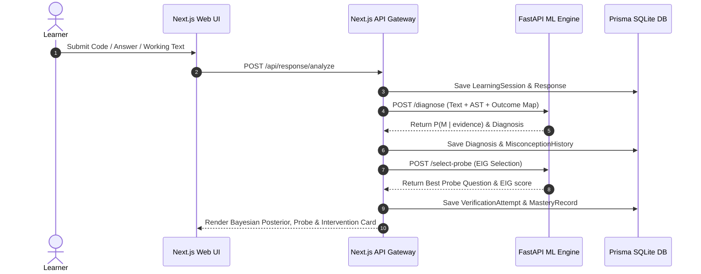

# Re:Learn System Architecture

## Pipeline Overview

## Core Algorithms
1. **Outcome Mapping:** Executes learner code vs candidate misconception predictions.
2. **Bayesian Belief Update:** $P(M \mid e) \propto P(e_{\text{text}} \mid M) \cdot P(e_{\text{outcome}} \mid M) \cdot P(M)$.
3. **Active Probe Selection (EIG):** Selects probes maximizing $\text{EIG}(Q) = H(P(M)) - \sum_{y} P(y \mid Q) H(P(M \mid Q, y))$.
4. **BKT Resolution State Machine:** Requires $\ge 2$ discriminating transfer probes + clean explanation check + delayed re-probe.
